# FAQ chatbot 项目实践指南


**FAQ chatbot 核心模块**
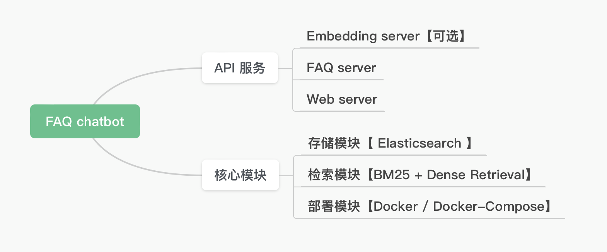

**FAQ chatbot 流程图**
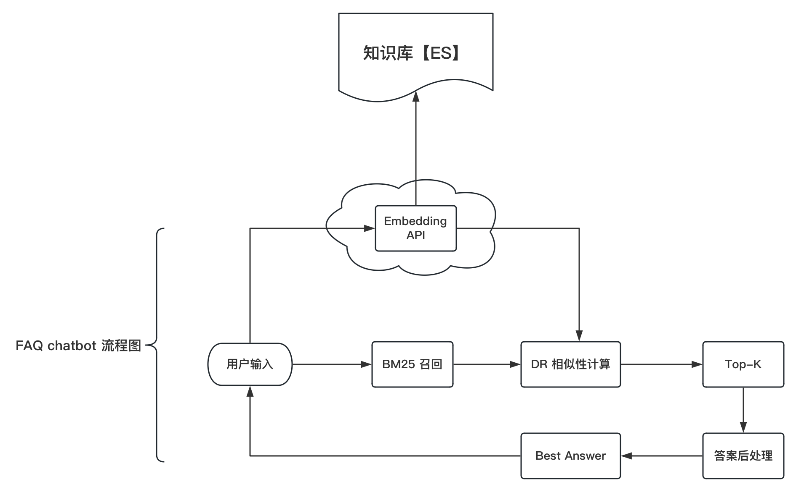

## 一、安装Elasticsearch，Kibana
[ES和Kibana安装指南](docs/ES向量数据库安装指南.md)
   
   
    
## 二、将样例数据写入索引
### 1. 创建索引并将样例数据写入索引
**注意：如果用自己的数据集，需要修改`es_config.py`中的变量`DATA_PATH`**
```shell
# 设置环境变量，告诉Python解释器在哪些目录中查找模块
export PYTHONPATH=$(pwd)

# 创建索引，写入数据
python vectorstore/es_index.py
```


## 三、基于Docker进行容器化部署
### 1. 在本机安装Docker
参考链接：[Docker教程](https://www.runoob.com/docker/docker-tutorial.html)

[Docker简介](docs/Docker简介.md)

### 2. 构建Docker镜像
在当前项目路径（根目录）下，Med-FAQchatbot/ 执行下面的命令。
```shell
# -t faq-chatbot选项为构建的镜像指定了一个标签（tag）
# . 指的是Dockerfile所在的目录的路径

docker build -t faq-chatbot:0.1 .
```
运行后截图：
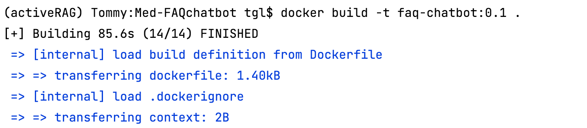

镜像已经构建成功：
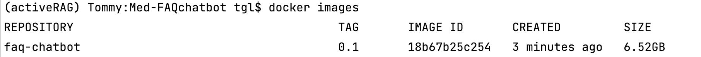

### 3. 运行Docker容器
```shell
docker run -itd -v $(pwd):/code -p 8008:7000 --name faq --net elastic faq-chatbot:0.1
```
运行后截图：
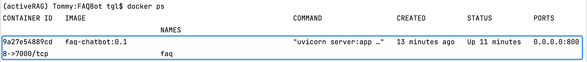

**可以进入Docker容器**
```shell
# 进入容器
docker exec -it faq /bin/bash

# 退出容器
exit
```

**<font color=red>！！！注意事项：</font>**
```shell
启动faq服务，一定要在 es_basic.py 修改 ES_URL 地址（ES_URL = "http://172.19.0.2:9200"），
不要使用 "http://0.0.0.0:9200"，要使用elasticsearch容器的IP地址。

# 查看容器的IP地址，可以使用命令，找到elasticsearch对应的IP地址
 docker network inspect elastic
```
截图如下：
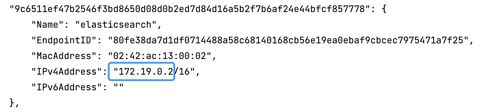

### 4. 服务测试
**方式-1 ： 终端运行 curl 命令**
```shell
 curl -X 'POST' 'http://127.0.0.1:8008/faq/search' -H 'accept: application/json' -H 'Content-Type: application/json' -d '{"text": "我最近长胖了，这让我有些尴尬，是否可以改善这一状况？"}'
```
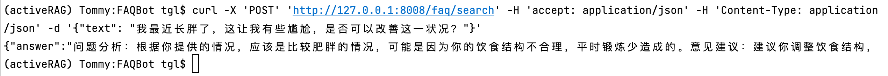

**方式-2 ：运行测试脚本 test_server.py**
```shell
pytest test_server.py -k test_faq_search -v -s
```
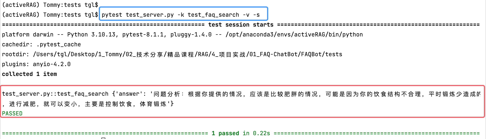

### 5. 并发测试【 CPU环境 】  
[本地部署 VS 容器化部署QPS差异的原因](/docs/本地部署VS容器化部署QPS差异原因.md)  
  
**场景-1：正常启动服务，直接运行 server.py，然后测试并发处理能力**
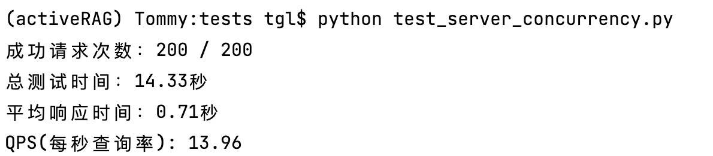

**场景-2：基于Docker部署服务，然后测试并发处理能力**
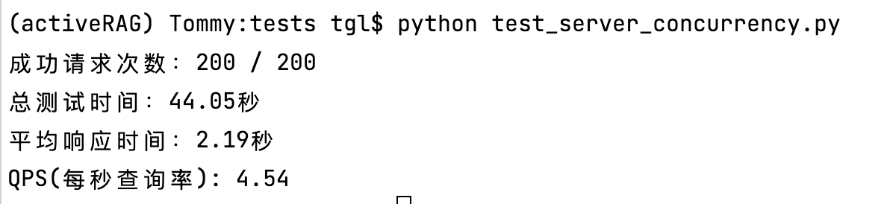

### 5. 基于Docker-Compose进行容器化部署
```shell
docker-compose up
```
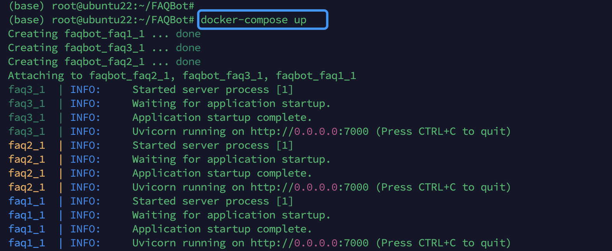

### 6. 再次测试服务，分别对应三个端口 7001, 7002, 7003
```shell
# 7001
curl -X 'POST' 'http://127.0.0.1:7001/faq/search' -H 'accept: application/json' -H 'Content-Type: application/json' -d '{"text": "我最近长胖了，这让我有些尴尬，是否可以改善这一状况？"}'
```
```shell
# 7002
curl -X 'POST' 'http://127.0.0.1:7002/faq/search' -H 'accept: application/json' -H 'Content-Type: application/json' -d '{"text": "我最近长胖了，这让我有些尴尬，是否可以改善这一状况？"}'
```
```shell
# 7003
curl -X 'POST' 'http://127.0.0.1:7003/faq/search' -H 'accept: application/json' -H 'Content-Type: application/json' -d '{"text": "我最近长胖了，这让我有些尴尬，是否可以改善这一状况？"}'
```
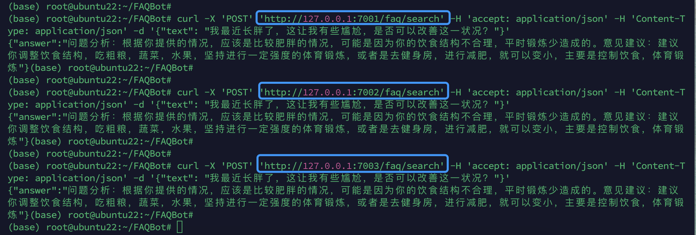
