# 安装ElasticSearch和Kibana

## 1. 创建网络
```shell
docker network create elastic
```
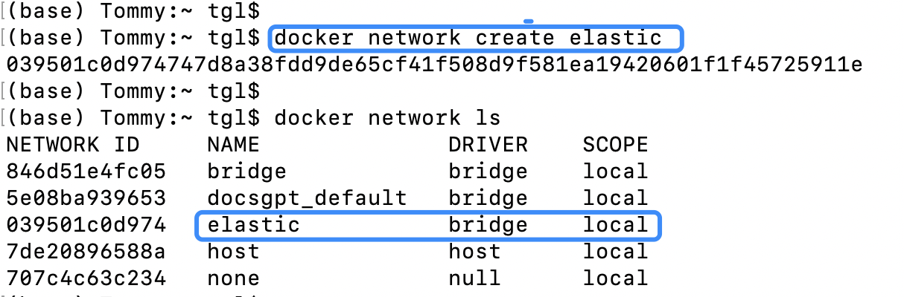

## 2. 创建Elasticsearch容器并运行
```shell
docker run -id --name es --net elastic -p 9200:9200 -p 9300:9300 \
-e "discovery.type=single-node" \
-e "xpack.security.enabled=false" \
-e "xpack.security.http.ssl.enabled=false" \
-e "xpack.security.enrollment.enabled=false" \
-e "ES_JAVA_OPTS=-Xms8g -Xmx8g" \
-t docker.elastic.co/elasticsearch/elasticsearch:8.12.2
```
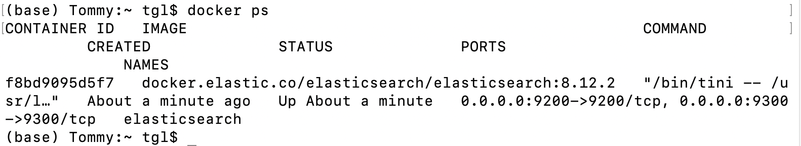

## 3. 创建Kibana容器并运行
```shell
docker run -id --name kibana --net elastic -p 5601:5601 docker.elastic.co/kibana/kibana:8.12.2
```
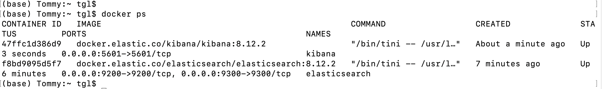

## 4. 下载IK分词器
**注意：下载的IK版本必须与Elasticsearch版本一致**  
```shell
https://github.com/infinilabs/analysis-ik/releases
```
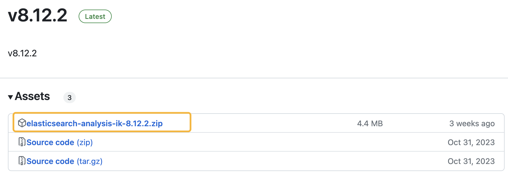

## 5. 将IK分词器压缩包拷贝到Elasticsearch容器内
```shell
# 语法
docker cp [宿主机文件路径] [容器ID或名称]:[容器内目标路径]
```
```shell
docker cp elasticsearch-analysis-ik-8.12.2.zip es:/usr/share/elasticsearch/plugins
```
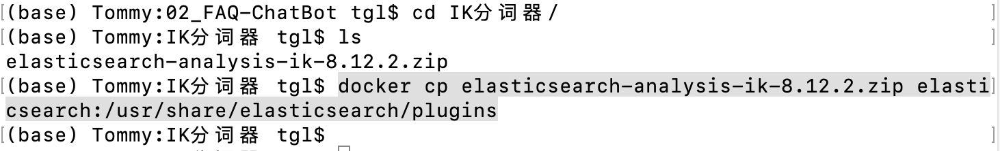

## 6. 在Elasticsearch容器内，进行解压
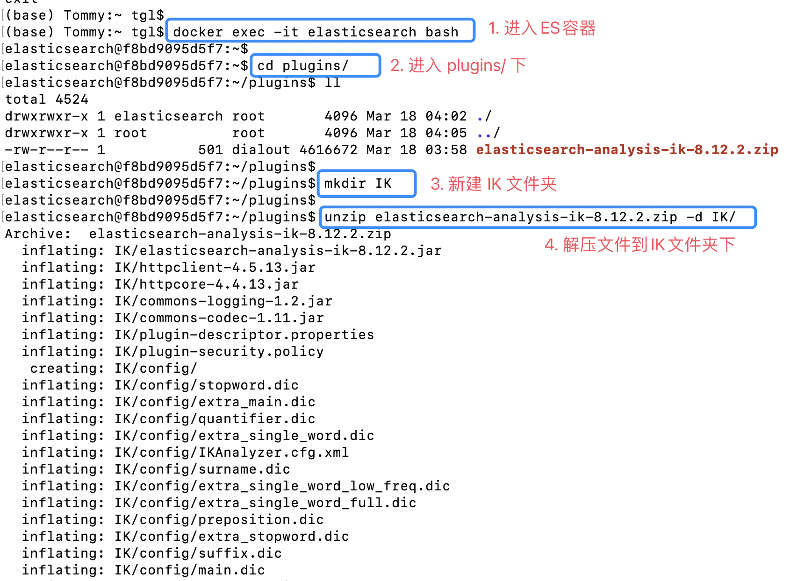

### 7. 重启Elasticsearch和kibana
```shell
docker restart elasticsearch
docker restart kibana
```
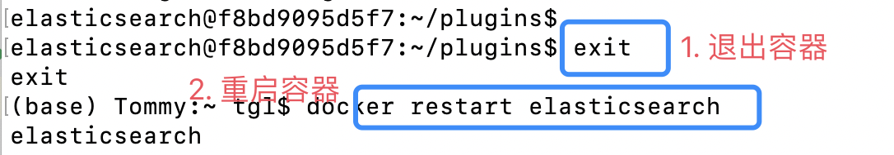

## 8. 在浏览器检验服务是否正常
```shell
http://localhost:9200/
```
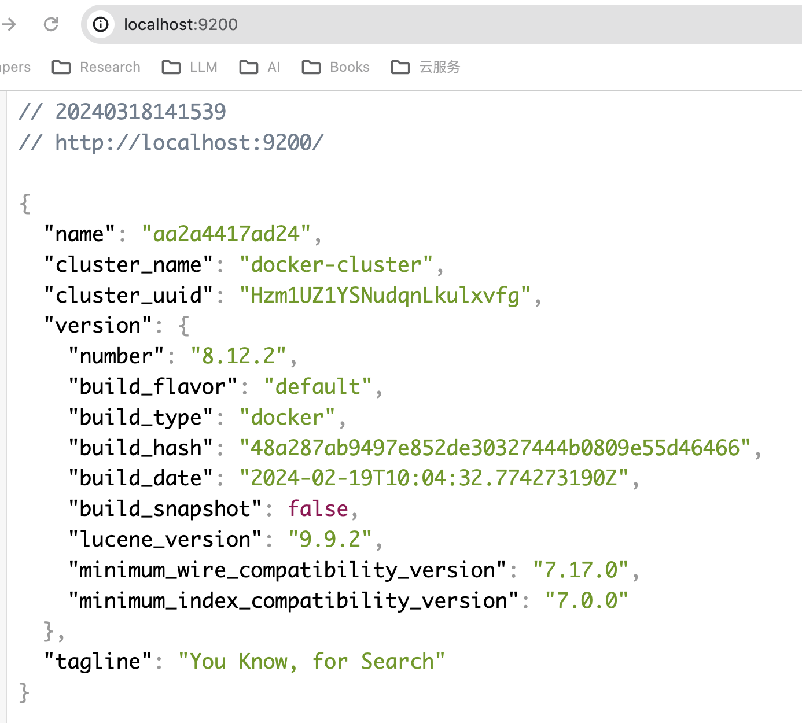

```shell
http://localhost:5601/app/home#/
```
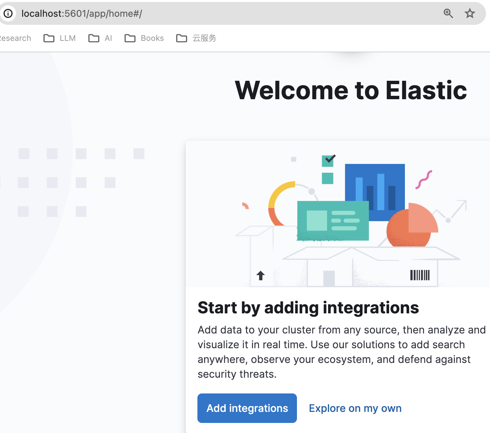

## 9. 点击"Explore On My Own"，然后，搜索：Dev Tools
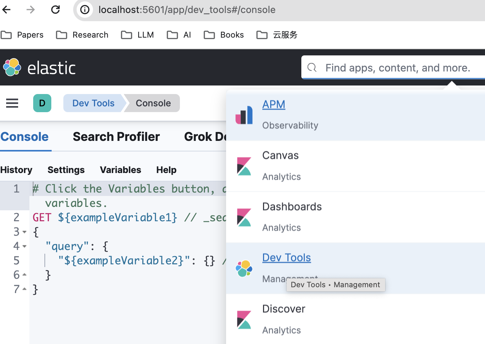

## 10. 在 Kibana 中验证分词效果
```shell
// ik_smart 模式，粗粒度模式

POST _analyze
{
  "analyzer": "ik_smart", 
  "text": "今天天气很好，我们一起去徒步。"
}
```
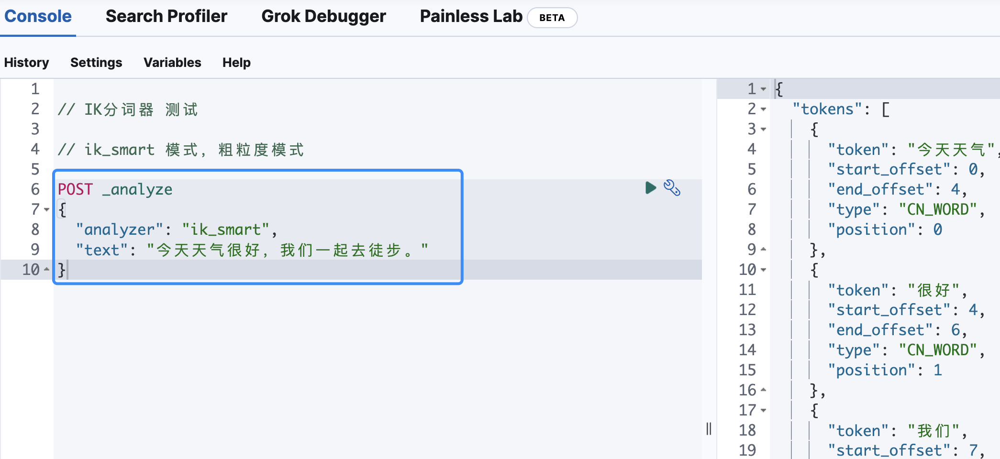

```shell
// ik_max_word 模式，细粒度模式
POST _analyze
{
  "analyzer": "ik_max_word",
  "text": "今天天气很好，我们一起去徒步。"
}
```
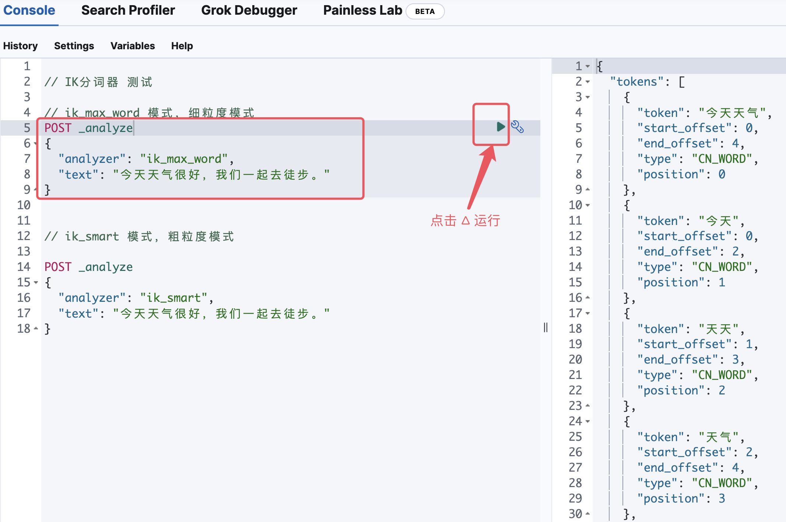

